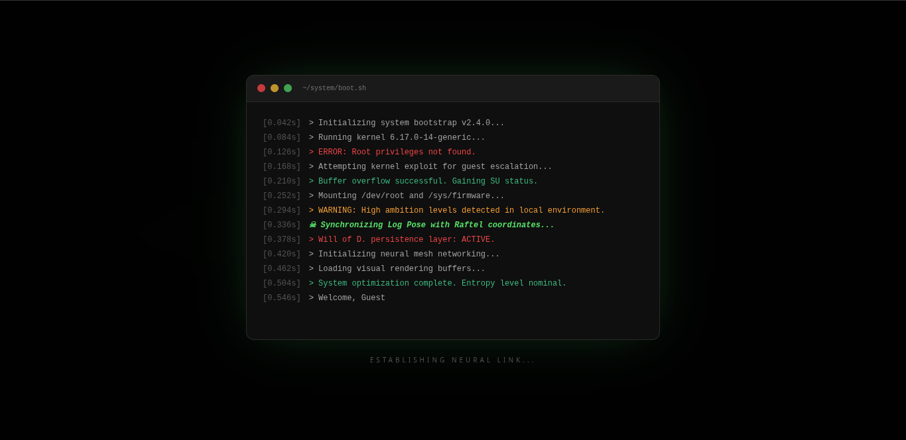
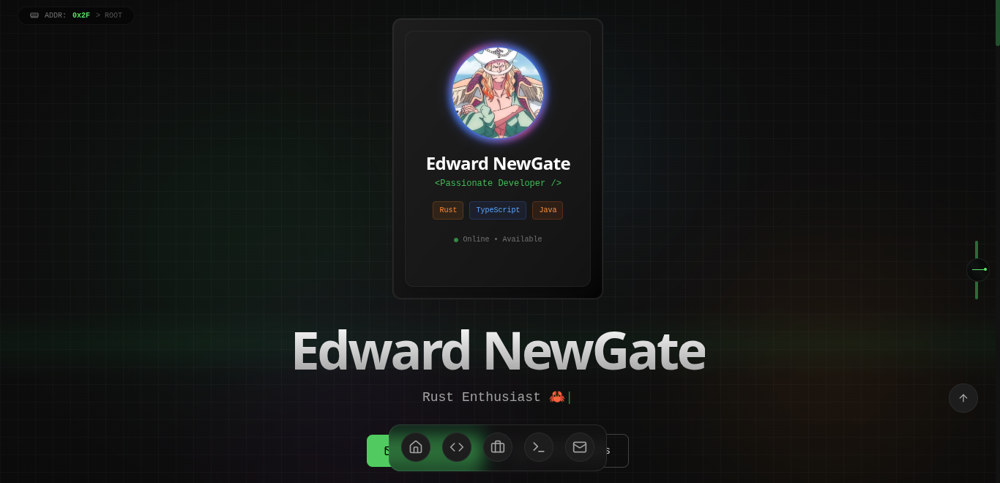
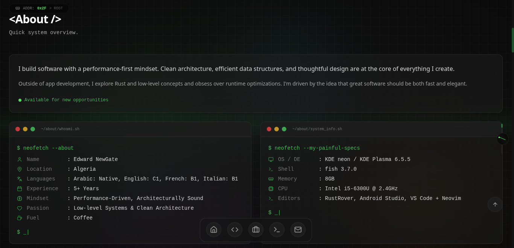
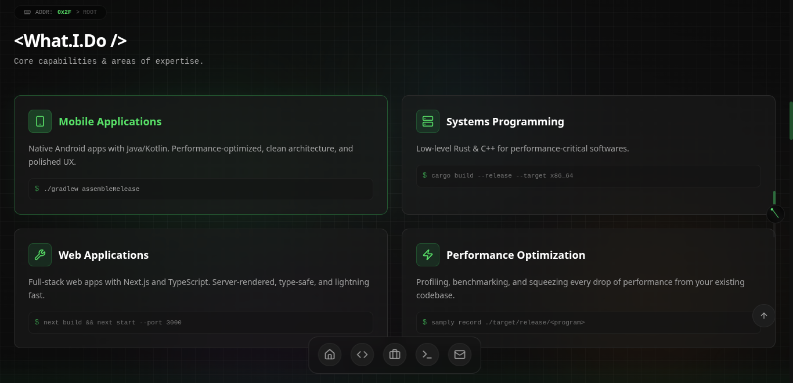
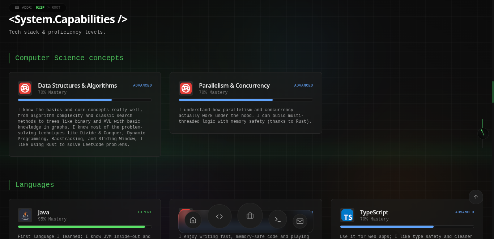
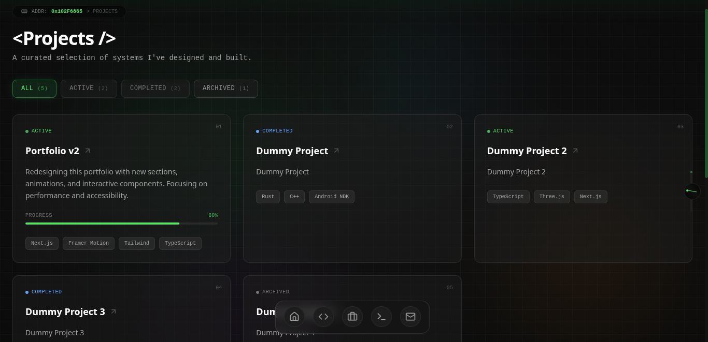
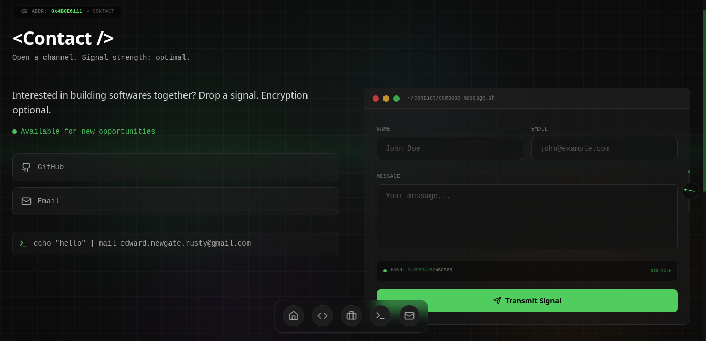

---

# dev-portfolio

My personal developer portfolio, built with Next.js, TypeScript, Tailwind CSS, and Framer Motion.

This isn't a template. It's my actual portfolio but you're free to fork it, tear it apart, and rebuild it however you like under the [MIT License](LICENSE.md)

Built around a terminal aesthetic because that's where I spend most of my time anyway.

🌐 **Live Demo :** [edward-newgate-portfolio.vercel.app](https://edward-newgate-portfolio.vercel.app)

# Screenshots

### - Boot Sequence :

On first visit, a terminal boot sequence plays before the site loads.



### - Home :

Profile card, rotating roles, and the floating dock at the bottom :



The about section,  bio, personal traits, and system specs displayed as `neofetch` output in terminal cards :



What I do,  services grid with inline terminal commands :



Interactive tech stack with skill cards grouped by category, mastery bars, and expandable descriptions :



### - Other Pages

Filterable project cards with status badges and tech tags :



Full interactive terminal with `ls`, `cd`, `neofetch`, `tree`, `echo`, and more :


Contact form backed by Supabase, styled to match the terminal theme :



---

## Overview

The **home page** has a profile card, an about me card, animated stats counters, a "what I do" breakdown, an interactive tech stack grid with skill bars, live GitHub stats using [github-readme-stats](https://github.com/anuraghazra/github-readme-stats) and [github-readme-streak-stats](https://github.com/DenverCoder1/github-readme-streak-stats), a philosophy/quotes section, and featured projects,  all with scroll-triggered animations.

A **floating dock** at the bottom handles navigation (macOS-style, with spring physics on hover). The background has slow-moving floating orbs and a subtle grid pattern.

Dark theme only, responsive across devices.

## Tech stack

| Layer       | Tech                                |
|-------------|-------------------------------------|
| Framework   | Next.js 16 (App Router)             |
| Language    | TypeScript                          |
| Styling     | Tailwind CSS + custom CSS variables |
| Animations  | Framer Motion                       |
| UI          | Radix UI primitives + shadcn/ui     |
| Backend     | Supabase (contact form)             |
| Fonts       | Inter + JetBrains Mono (Google)     |
| Icons       | Lucide React                        |
| Deployment  | Vercel                              |

## Getting started

### Requirements

- Node.js 22+  
- npm (or pnpm/yarn, whatever you prefer)

### Setup

```bash
# clone it
git clone https://github.com/Edward-NewGate-KOC/dev-portfolio.git
cd dev-portfolio

# install dependencies
npm install

# run the dev server
npm run dev
```

### Environment variables

Create a `.env.local` file in the root with the following:

```env
NEXT_PUBLIC_SUPABASE_URL=your_supabase_url
NEXT_PUBLIC_SUPABASE_ANON_KEY=your_supabase_anon_key
```

The contact form won't work without these, but the rest of the site runs fine.

## Customizing it

If you want to use this as a starting point for your own portfolio:

Check **[Configs.ts](src/lib/config.ts)**,  change your name, bio, socials, avatar URL, system specs, and swap out skills, projects, experience entries, and philosophy quotes, most of the site reads from it, so you can get pretty far without touching the components themselves.

## Contributing

Contributions are welcome,  bug reports, feature requests, or PRs. If something looks off or you have an idea, open an issue and let's talk about it.

If you found this helpful, learned something from it, or just liked the vibe,  I'd really appreciate a ⭐ on the repo it means a lot.